# Haulage-Analysis
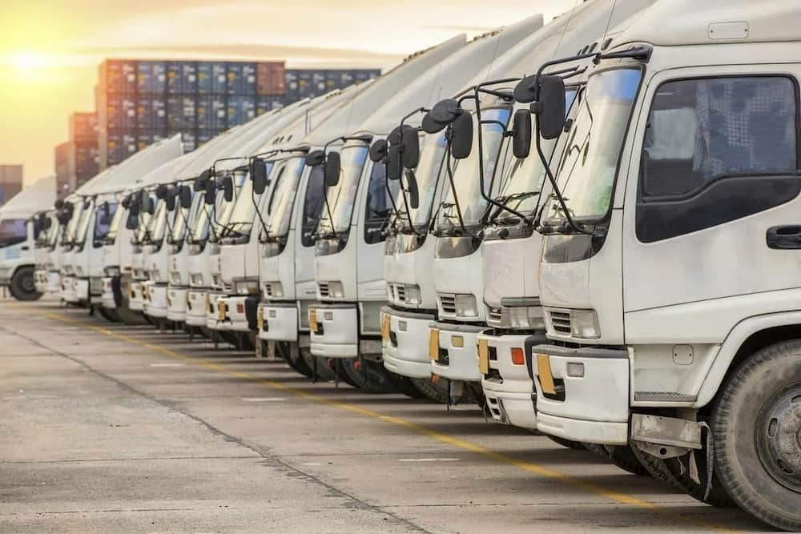

## Information: 
This is a Power Bi Analysis on an Haulage Company. The Project is to analyze the data and answer crucial questions that would lead to an efficient and more improved way of work and increase the ROI of the Company and Customer Satisfaction. It is also to analyze the efficient workers to reward them. 

**_Disclaimer:_** All datasets and reports do not represent any company, institution or company but just a dummy datasets to demonstrate capabilities of Power Bi.

## Problem Statement:
1.	Which trip makes more profit? 
2.	Which driver generates more revenue?
3.	Which depot should more trucks be deployed to?
4.	Who is our top customer and where are they located

## Skills Demonstrated: 

1.	Writing Dax
2.	Data Modelling
3.	Page Navigation
4.	Button
5.	Filters

## Data Transformation: 

The datasets had 5 tables originally.**They are Closed Trips, Open Trips, Trip Rates, Truck List and Truck Classification.**
In order to have a table consisting of all the trips I merged the Closed Trips and Open Trips to Create a New Table called Trip list. This table had many issues after merging because the drivers in the Open trip were not documented while it was documented in the Closed trip it. also had some blanks. I resolved this by doing a driver analysis only on the closed trips. Due to data entry some names were written twice sometimes thrice I also had to deal with that by replacing values

## Modelling: 
The model is a star-schema. It has 1 Fact Table and 5-dimension tables. 3 of the dimension tables are in a one-to-many relationship while the other 2 are in a one-to-one relationship to the Fact table

## Visualizations: 
The report consists of 13 pages:
1.	Truck
2.	Trip
3.	Route Map
4.	Destination
5.	Driver
6.	Driver Analysis
7.	Driver Performance trend
8.	Decomposition
9.	Revenue
10.	Expenses
11.	Gross Profit
12.	Regression 
13.	Yearly Performance

## Analysis:
1.	**Truck:**
The company currently has a total of 593 trucks with different classifications. 591 are actually running while 2 are under repair
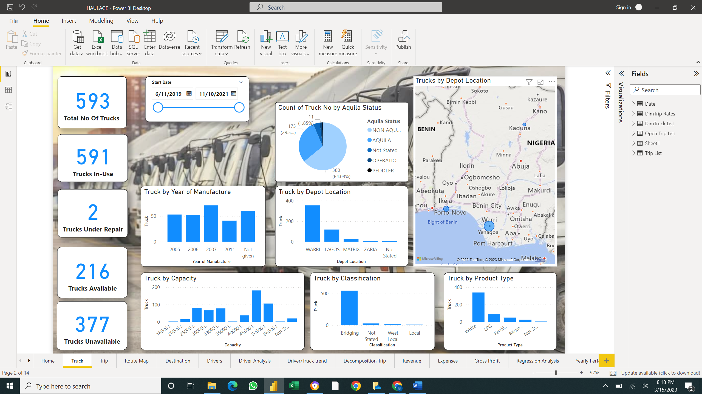
-----
2.	**Trip:**
A total of 15,019 trips were made by the company within the first 3 years of operation. 
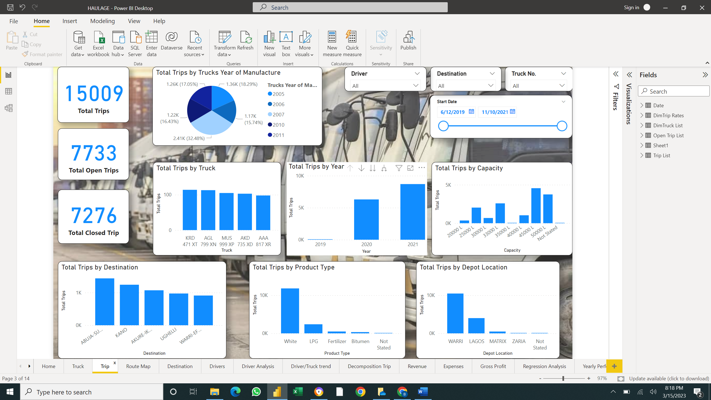
-----
3.	**Route Map:**
It can be seen that the Warri depot has more trips carried out from it than any other depot
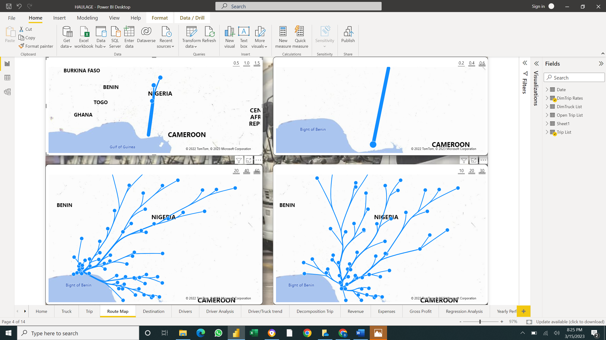
----
4.	**Destination:**
Abuja-Suleja is the most visited place with a total of 1435 trips in the last three years
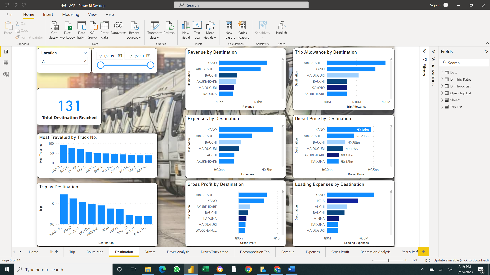
----
5.	**Driver:**
It can be seen that though Bala Ishaka bring in more revenue Muntari Adamu has the highest trip allowance over the years
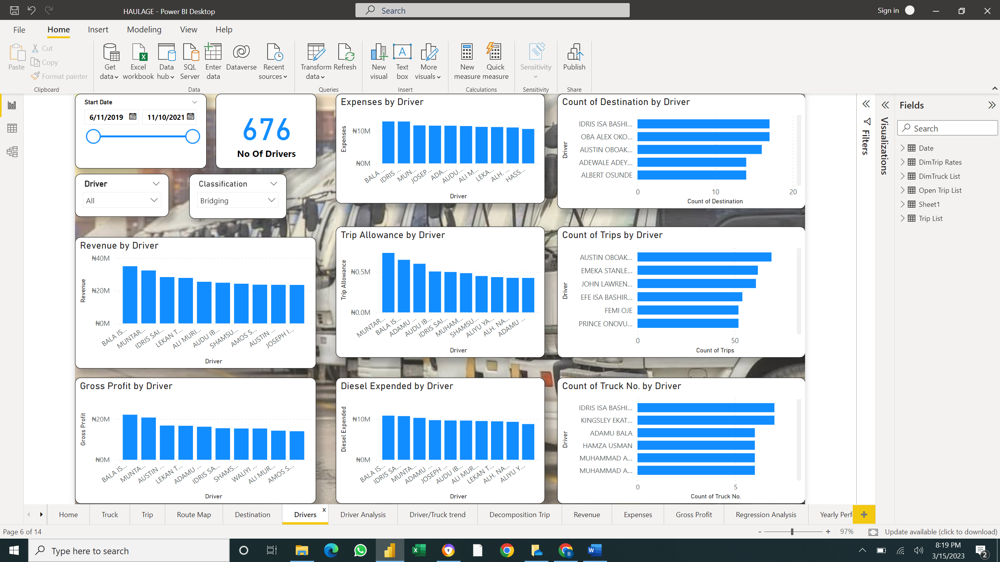
----
6.	**Driver Analysis:**
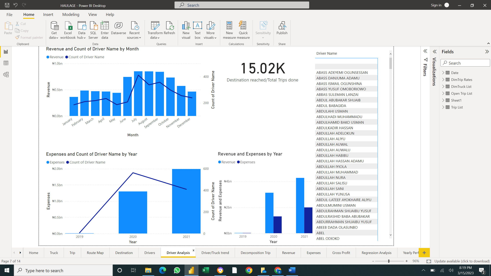
----
7.	**Driver Performance trend:**
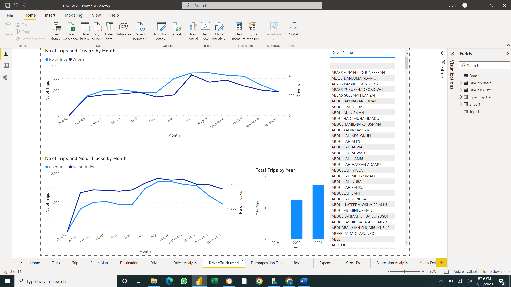
----
8.	**Decomposition:**
It can be seen that though we have 15019 trips only 6836 trips are associated with drivers 
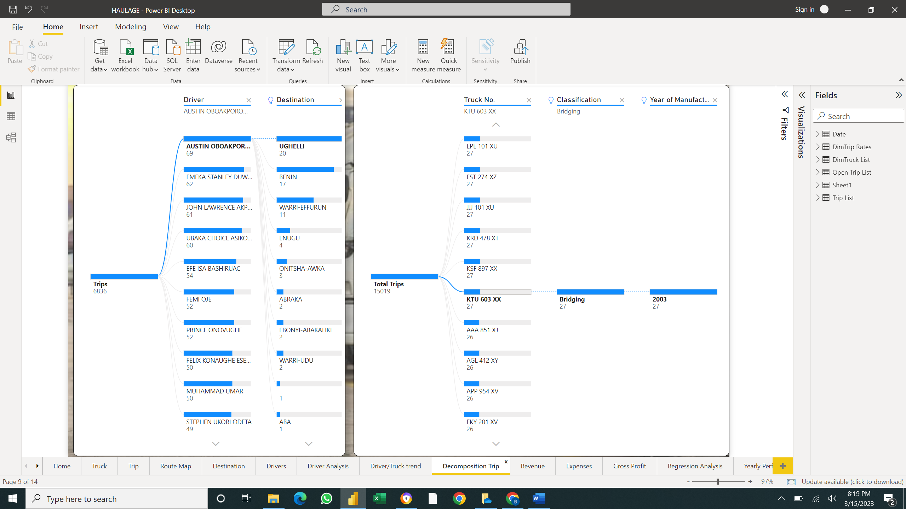
-----
9.	**Revenue:**
It can be seen that Warri depot brought in the highest revenue
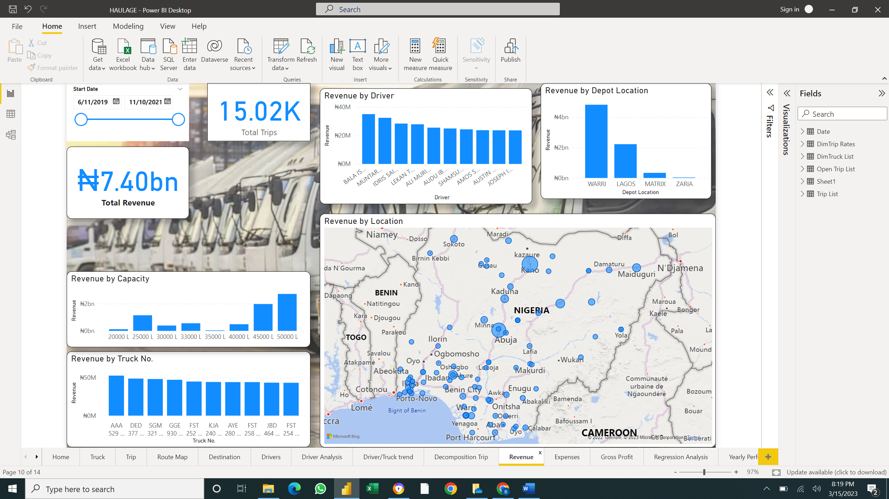
-----
10.	**Expenses:**
It can be seen that Warri depot also had the highest expenses
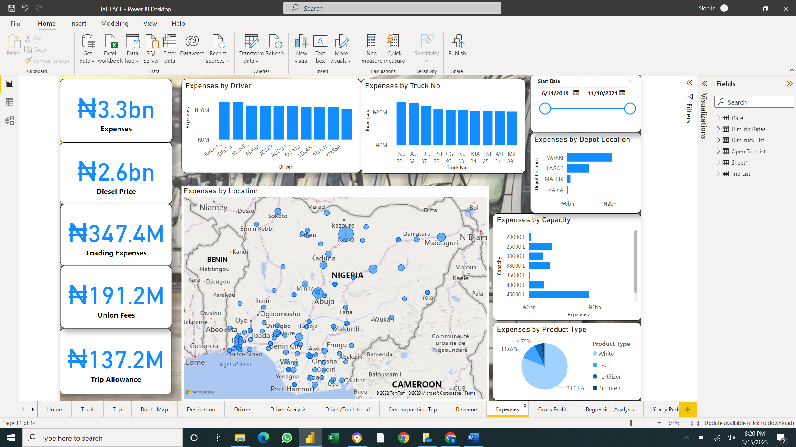
-----
11.	**Gross Profit:**
It can be seen that Warri depot, White Product and Bala Ishaka a driver all generated the highest profit in their unit respectively
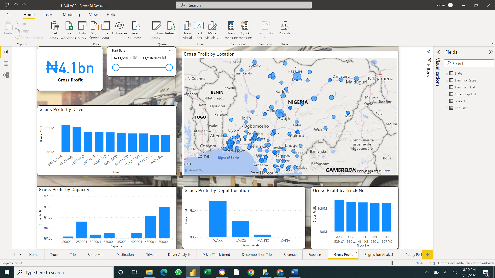
-----
12.	**Regression:** 
A correlation can be seen between Revenue and Profit based on Classification
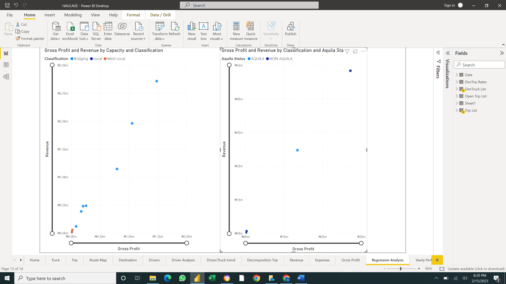

## Recommendation: 
Due to the analysis
1.	 I would suggest that the company focuses on other products as white is their main source of revenue which could lead to the fall of the company if such products are banned.
2.	The data entry of the company should be monitored to avoid blanks in the future data

## **Thank You for going through my documentation process.** 

